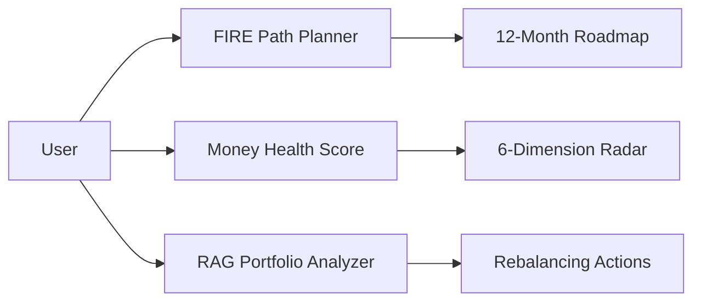
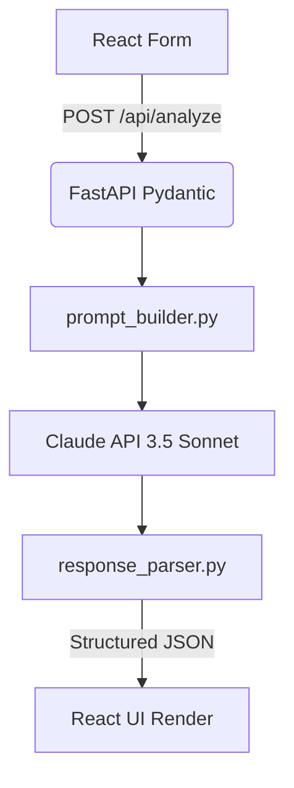
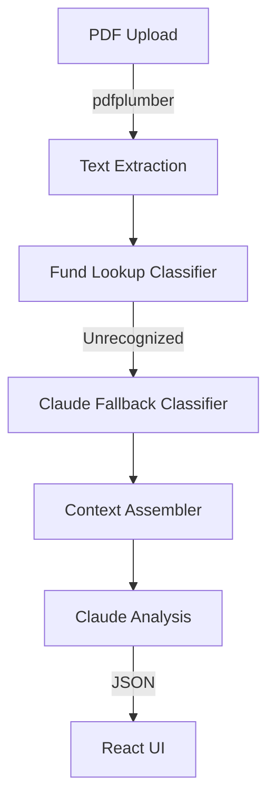
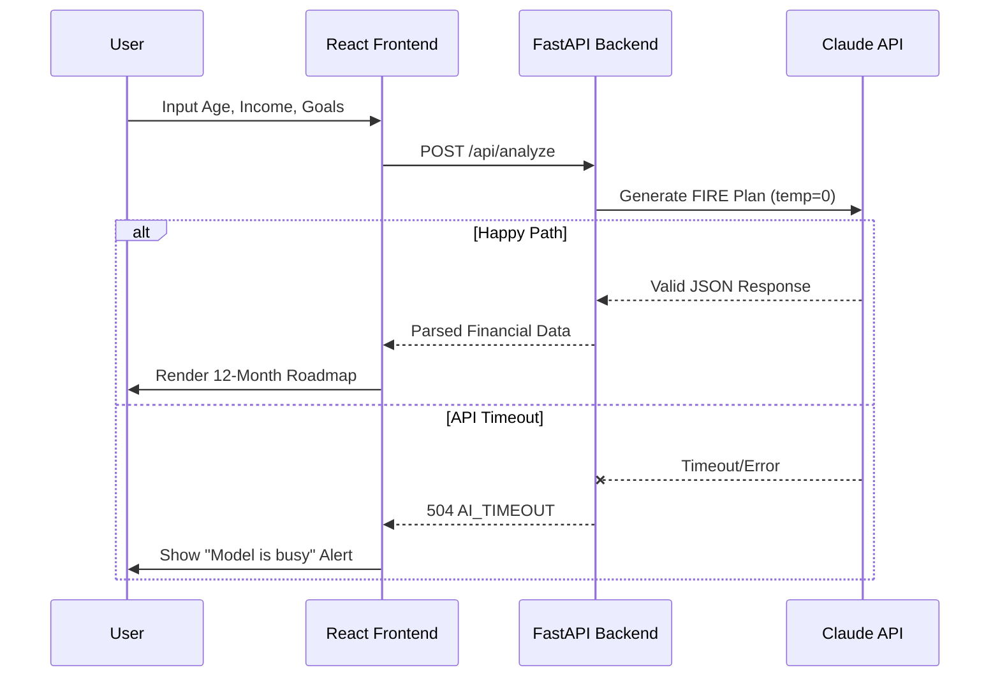
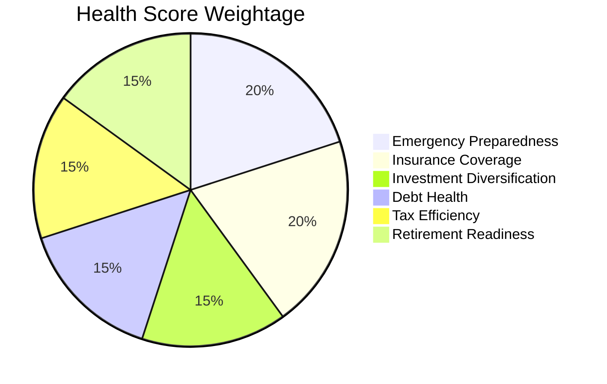
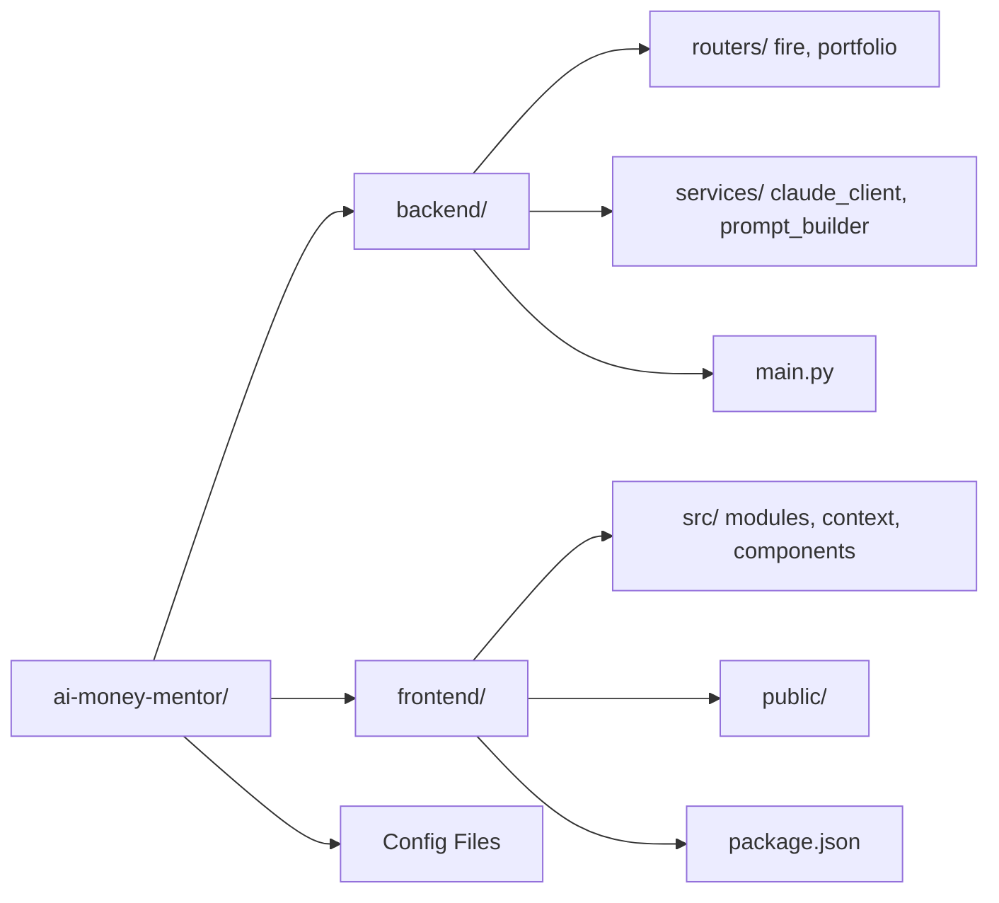

# [AI Money Mentor](https://ai-money-mentor.demo)

### Your pocket-sized personalized financial strategist for the Indian marathon to FIRE.


AI Money Mentor transforms complex financial data into a hyper-personalized roadmap for Financial Independence, Retire Early (FIRE). By combining secure PDF portfolio analysis with real-time AI guidance, it helps salaried professionals bridge the gap between "earning well" and "planning well."

## 🎯 Why This Exists

*   **Financial Literacy Gap**: Only 27% of Indian adults meet the minimum financial literacy standards ([SEBI Survey](https://www.sebi.gov.in)). This leads to suboptimal asset allocation and missed wealth-creation opportunities.
*   **The Protection Gap**: India's insurance penetration remains significantly low at ~4.2% of GDP ([IRDAI Annual Report](https://www.irdai.gov.in)). Most professionals lack adequate life or health coverage to protect their FIRE journey.
*   **Low Financial Savings**: Household net financial savings dropped to a multi-decadal low of 5.1% of GDP in FY23 ([RBI Bulletin](https://www.rbi.org.in)). Salaried earners need automated, intelligent tools to prioritize savings over discretionary spending.

## ⚙️ Three Tools, One Goal



**FIRE Path Planner** acts as your long-term navigator, calculating exactly when you can stop working based on your current lifestyle and future goals. It generates a month-by-month investment roadmap and tax-saving alerts, ensuring every rupee is working toward your freedom.

**Money Health Score** provides an instant diagnostic of your financial robustness across six critical dimensions like emergency preparedness and debt health. It doesn't just give you a number; it identifies your weakest link and gives you three immediate "doctor's orders" to fix it.

**RAG Portfolio Analyzer** deep-dives into your actual holdings by reading your official CAMS/NSDL statements (PDF). It automatically classifies your mutual funds and flags concentration risks or high-cost overlaps, suggesting specific rebalancing actions to align with your risk profile.

## ⚙️ How It Works Under the Hood

### Modules 1 & 2: Planning & Health Logic



When you enter your profile, FastAPI validates the data via Pydantic before the system builds a structured prompt with specific financial formulas. Claude 3.5 Sonnet analyzes the surplus and goals, returning a strict JSON object that is re-parsed for consistency before the React frontend renders interactive charts and tables.

### Module 3: RAG Portfolio Pipeline



The portfolio analyzer uses `pdfplumber` to extract raw data from investment statements, which is then mapped against a local asset class registry. For new or obscure funds, Claude acts as an intelligent classifier before the entire portfolio context is analyzed against risk benchmarks to generate rebalancing advice.

**LLM Configuration**: All Claude calls are pinned to `temperature=0`. In financial applications, deterministic accuracy is paramount; we need the same mathematical rigor every time, not creative variability.

## ⚙️ What Using It Feels Like



## ⚙️ Your Financial Health, Measured



| Dimension | Score Formula | What a Low Score Means |
| :--- | :--- | :--- |
| Emergency Preparedness | Liquid savings vs 6 months of expenses | High risk of debt during job loss or medical crisis |
| Insurance Coverage | Actual cover vs 20x annual income | Family's lifestyle is unprotected from life's "what-ifs" |
| Investment Diversification | Spread across asset classes (Equity/Debt/Gold) | Portfolio is too sensitive to a single market crash |
| Debt Health | Monthly EMI as % of take-home pay | Debt is eating your future wealth-creation potential |
| Tax Efficiency | Utilization of Section 80C/84D limits | You are paying more tax than legally required |
| Retirement Readiness | Savings vs target "FIRE Number" | You are currently off-track for your chosen retirement age |

## ⚙️ Run It Yourself

### Prerequisites
- Node 18+
- Python 3.11+
- Anthropic API Key (Claude 3.5 Sonnet access)

### 1. Clone & Environment
```bash
git clone https://github.com/anujbolewar/AI-Mentor.git
cd AI-Mentor
```

Create a `.env` file in the `backend/` directory:
```env
ANTHROPIC_API_KEY=your_sk_ant_key_here
```

### 2. Backend Setup
```bash
cd backend
python -m venv .venv
source .venv/bin/activate  # Windows: .venv\Scripts\activate
pip install -r requirements.txt
uvicorn main:app --reload --port 8000
```

### 3. Frontend Setup
```bash
cd ../frontend
npm install
npm start
```

**Note**: The backend runs on `localhost:8000` and the frontend runs on `localhost:3000`.

## ⚙️ Codebase at a Glance



## ⚙️ Built With

| Layer | Technology | Why This Choice |
| :--- | :--- | :--- |
| Frontend | React 18 | Component-based architecture for complex multi-step wizards |
| Backend | FastAPI (Python) | High-performance async handling of heavy LLM requests |
| LLM | Claude 3.5 Sonnet | 200K context window handles large portfolio PDFs without chunking |
| PDF Extraction | `pdfplumber` | Superior extraction of tabular mutual fund data from statements |
| Visualization | Recharts | Declarative SVG charts balance performance with rich animations |
| Styling | Vanilla CSS | Maximum control over the "Premium Dark" aesthetic without utility bloat |

## ⚙️ About This Project

*   **Team**: 4 final-year B.Tech CS (AI/ML) students, YCCE Nagpur
*   **Event**: ET Gen AI Hackathon 2026
*   **Problem Statement**: PS 9 — AI Money Mentor
*   **Build Time**: ~11 hours prototype

Unlike generic chatbots, AI Money Mentor combines deterministic rule-based validation with generative insights. It won't just tell you "buy stocks"; it reads your specific CAMS statement, calculates your real-world tax liability, and gives you a mathematical reason for every recommendation.

## ⚖️ License & Disclaimer

MIT License.

**Disclaimer**: This tool provides educational financial analysis based on user input and AI modeling. It is not SEBI-registered investment advice. Please consult a certified financial planner before making significant investment decisions.
